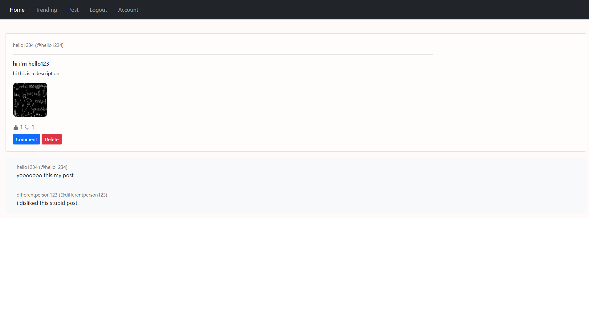
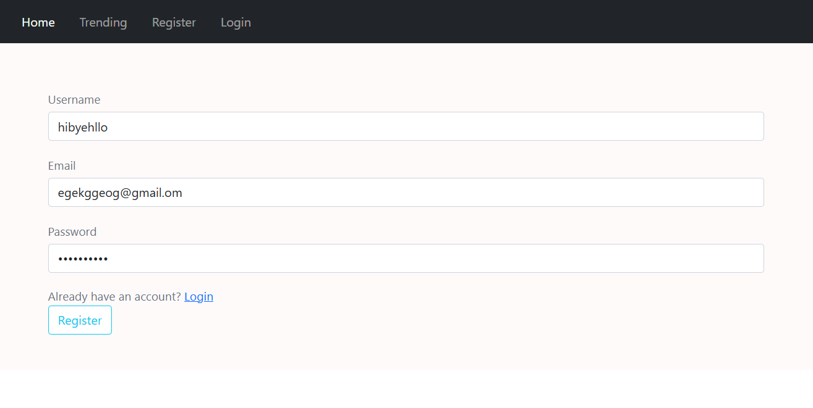
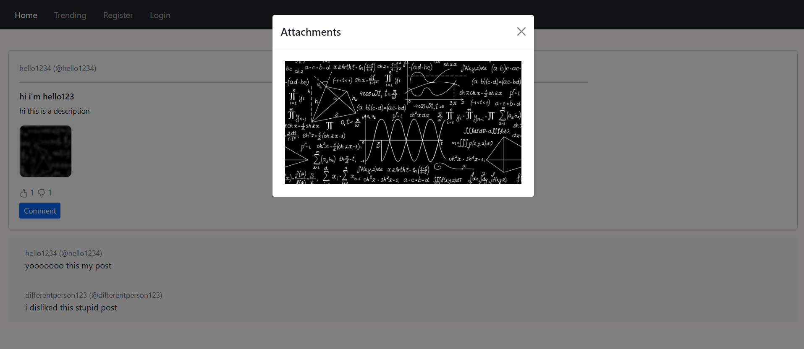

🐦 Twitter-Style Web Application  
A Flask-based social platform featuring user authentication, posts, comments, voting, image uploads and account management.
  

🚀 Features  
- Create and view posts  
- Dynamic feed displaying recent content  
- Basic user interaction functionality  
- Backend handling of posts and data  

🛠️ Technologies Used  
- Frontend: HTML, CSS  
- Backend: Python  
- Other: Flask, Jinja2, SQLAlchemy, WTForms, Bcrypt, Werkzeug, Pillow  

📸 Overview  
- This project was built to explore how social media platforms work, including handling user input, displaying dynamic content, and managing data between the frontend and backend.  
## Screenshots  

### Home Feed  
  
 
### Login Page  
  
### Viewing Attachments  
  
 

⚠️ Notes  
- This is a prototype and focuses more on functionality than design. The user interface is basic, but the core features are implemented and are working.  
 

▶️ How to Run 
- Clone the repository 
- Navigate to the project folder 
- Install any dependencies (if required) 
- Run the application (run.py) 

git clone https://github.com/1ostrich2/Flask-Social-Media-App.git  
cd Flask-Social-Media-App/"My Blog Page"  
python -m venv .venv  

 

📚 What I Learned 
- How to structure/package a full-stack web application 
- Handling user input and updating the UI dynamically 
- Basics of backend development 
- Authentication and authorization 
- Pagination 
- One-To-Many DB relationships 
- Debugging and improving functionality over time 
 

🔗 Future Improvements 
- Improve UI/UX design 
- Enhance responsiveness for mobile devices 
  

👤 Author 
- GitHub: https://github.com/1ostrich2
